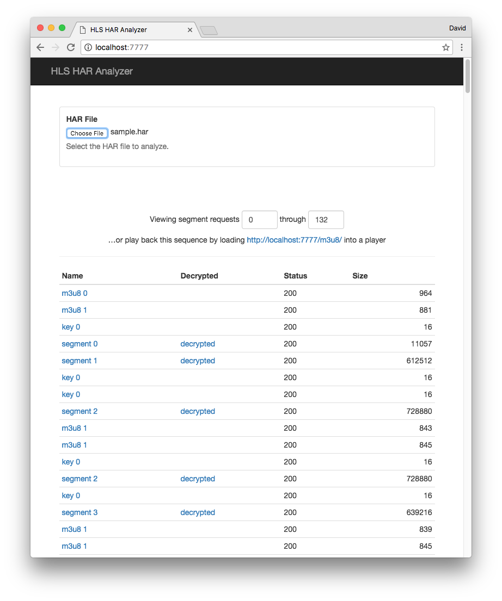

# HLS HAR Analyzer

A tool to help debug HAR captures of HLS streams playing back.

## Getting started

Install the analyzer with npm:

```sh
npm install hls-har-analyzer
```

then startup the server using the start script:

```sh
npm start
```

Now you can load up the analyzer in your browser by visiting [http://localhost:7777](http://localhost:7777).

## What's it good for?

Live streaming is really hard to debug. If you're not the one
experiencing the problem, how do you collect enough information from
your viewers to fix an issue? A common technique is to capture an
[HTTP Archive](https://en.wikipedia.org/wiki/.har) (or HAR file) from
someone who *can* reproduce that issue and then send it to an expert
for analysis. There are [generic tools out there for visualizing HAR
files](http://www.softwareishard.com/blog/har-viewer/) but it can take
a lot of work to dig out the important pieces from a log of all
captured traffic.

The HLS HAR analyzer is designed to filter out only the requests
related to playback of HLS video. It allows you to quickly review the
requests related to HLS playback and will even decrypt TS segments if
all of the necessary info is available in the capture. If you're the
expert called in to diagnosis a live streaming problem, hopefully it
saves you from a bunch of manual steps and lets you identify issues
faster.

## Using the analyzer
Once you have the server running, open the [main
page](http://localhost:7777) in a modern browser of your choice. Use
the input form at the top to upload your HAR file and then you'll see
a table like this:



From here, you can click on a file name to download it (or open it in
a browser window) directly. If it's a TS segment that appears to be
encrypted, you can click the "decrypted" link to download a clear
version of the segment.